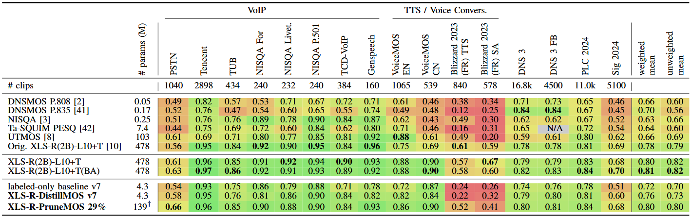

<h1 align="center">Distillation and Pruning for Scalable Self-Supervised Representation-Based Speech Quality Assessment</h1>

This repository contains sample code and weights accompanying the paper "Distillation and Pruning for Scalable Self-Supervised Representation-Based Speech Quality Assessment".

## Intended Uses

### Primary Use Cases

The model released in this repository takes a short speech recording as input and predicts its perceptual speech quality by providing an estimated mean opinion score (MOS). 
The model is much smaller than other state-of-the-art MOS estimators, providing a trade-off between parameter count and speech quality estimation performance.
The primary use of this model is to reproduce results reported in the paper and for research purposes as a relatively light-weight MOS estimation model that generalizes across a variety of tasks. 

### Use Case Considerations and Model Limitations

The model is only evaluated on the tasks reported in the paper, including deep noise suppression and signal improvement, and only for speech. The model may not generalize to unseen tasks or languages. 
Use of the model in unsupported scenarios may result in wrong or misleading speech quality estimates. 
When using the model for a specific task, developers should consider accuracy, safety, and fairness, particularly in high-risk scenarios. 
Developers should be aware of and adhere to applicable laws or regulations (including privacy, trade compliance laws, etc.) that are relevant to their use case.

***Nothing contained in this Model Card should be interpreted as or deemed a restriction or modification to the license the model is released under.*** 

## Usage

### Sample Inference Code

The file `sample.py` illustrates how to load a speech recording and use the model to estimate the speech quality from 1 (`bad`) to 5 (`excellent`).

### Local Installation

To use the model locally, simply install using pip:

```bash
pip install distillmos
```

## Benchmarks



## Training


|                     |     |
|---------------------|-----| 
| Developer           | Microsoft |
| Architecture        | Convolutional transformer |
| Inputs              | Speech recording |
| Input length        |  |
| GPUs                | 4 x A6000 |
| Training time       | |
| Training data       | |
| Outputs             | Estimate of speech quality mean-opinion score (MOS) |
| Dates               | Trained between May and July 2024 |
| Status              | |
| Supported languages | English |
| Release date        | Oct 2024 |
| License             | MIT |

### Training Datasets

The model is trained on a large set of speech samples:

- About 2600 hours of unlabeled speech and 180 hours of noise recordings from the <a href="https://www.microsoft.com/en-us/research/academic-program/deep-noise-suppression-challenge-icassp-2022/">ICASSP 2022 Deep Noise Suppression Challenge</a>
- The output of publicly available <a href="https://github.com/coqui-ai/TTS">text-to-speech synthesis models</a>
- <a href="https://www.isca-archive.org/interspeech_2020/mittag20b_interspeech.pdf">PSTN</a>
- <a href="https://github.com/ConferencingSpeech/ConferencingSpeech2022">ConferencingSpeech 2022 Challenge</a>
- <a href="https://www.isca-archive.org/interspeech_2021/mittag21_interspeech.pdf">NISQA</a>
- <a href="https://voicemos-challenge-2022.github.io">VoiceMOS Challenge 2022</a>
- Submissions to <a href="https://www.microsoft.com/en-us/research/uploads/prod/2021/06/0006608.pdf">ICASSP 2021 Deep Noise Suppression Challenge</a>
- Submissions to <a href="https://www.isca-archive.org/interspeech_2022/diener22_interspeech.pdf">Interspeech 2022 audio deep packet loss concealment challenge</a>
- Submissions to <a href="https://www.microsoft.com/en-us/research/academic-program/speech-signal-improvement-challenge-icassp-2023">ICASSP 2023 Speech Signal Improvement Challenge</a>
  
## Responsible AI Considerations

Similarly to other (audio) AI models, the model may behave in ways that are unfair, unreliable, or inappropriate. Some of the limiting behaviors to be aware of include:

* **Quality of Service** and **Limited Scope**: The model is trained primarily on spoken English and for speech enhancement or degradation scenarios. Evaluation on other languages, dialects, speaking styles, or speech scenarios may lead to inaccurate speech quality estimates.

* **Representation and Stereotypes**: This model may over- or under-represent certain groups, or reinforce stereotypes present in speech data. These limitations may persist despite safety measures due to varying representation in the training data.

* **Information Reliability**: The model can produce speech quality estimates that might seem plausible but are inaccurate.

Developers should apply responsible AI best practices and ensure compliance with relevant laws and regulations. Important areas for consideration include:

* **Fairness and Bias**: Assess and mitigate potential biases in evaluation data, especially for diverse speakers, accents, or acoustic conditions.

* **High-Risk Scenarios**: Evaluate suitability for use in scenarios where inaccurate speech quality estimates could lead to harm, such as in security or safety-critical applications.

* **Misinformation**: Be aware that incorrect speech quality estimates could potentially create or amplify misinformation. Implement robust verification mechanisms.

* **Privacy Concerns**: Ensure that the processing of any speech recordings respects privacy rights and data protection regulations.

* **Accessibility**: Consider the model's performance for users with visual or auditory impairments and implement appropriate accommodations.

* **Copyright Issues**: Be cautious of potential copyright infringement when using copyrighted audio content.

* **Deepfake Potential**: Implement safeguards against the model's potential misuse for creating misleading or manipulated content.

Developers should inform end-users about the AI nature of the system and implement feedback mechanisms to continuously improve alignment accuracy and appropriateness.

## Contributing

This project welcomes contributions and suggestions.  Most contributions require you to agree to a
Contributor License Agreement (CLA) declaring that you have the right to, and actually do, grant us
the rights to use your contribution. For details, visit https://cla.opensource.microsoft.com.

When you submit a pull request, a CLA bot will automatically determine whether you need to provide
a CLA and decorate the PR appropriately (e.g., status check, comment). Simply follow the instructions
provided by the bot. You will only need to do this once across all repos using our CLA.

This project has adopted the [Microsoft Open Source Code of Conduct](https://opensource.microsoft.com/codeofconduct/).
For more information see the [Code of Conduct FAQ](https://opensource.microsoft.com/codeofconduct/faq/) or
contact [opencode@microsoft.com](mailto:opencode@microsoft.com) with any additional questions or comments.

## Trademarks

This project may contain trademarks or logos for projects, products, or services. Authorized use of Microsoft 
trademarks or logos is subject to and must follow 
[Microsoft's Trademark & Brand Guidelines](https://www.microsoft.com/en-us/legal/intellectualproperty/trademarks/usage/general).
Use of Microsoft trademarks or logos in modified versions of this project must not cause confusion or imply Microsoft sponsorship.
Any use of third-party trademarks or logos are subject to those third-party's policies.
